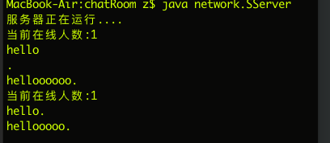

# 聊天室
利用 `java` 的 `socket` 库实现的聊天室

# 使用方法
```
git clone https://github.com/vzyw/chatRoom
cd chatRoom
javac -d ./ SClient.java SServer.java #编译程序
java network.SServer #启动服务器
java network.SClient #在另外一个终端启动客户端
#启动完成后填入主机地址和端口号后点连接，这两者可以在 SServer.java 中改
```
# 预览
客户端：


服务器：


